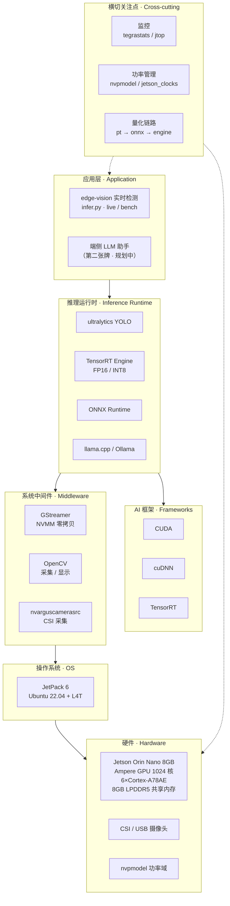
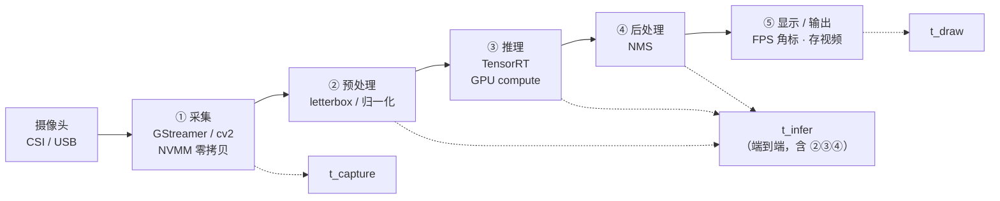
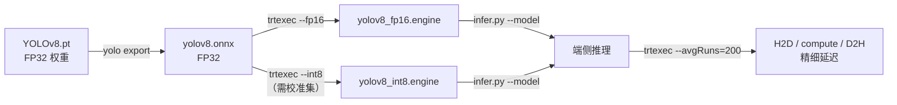

# 端侧视觉推理 · 总体技术架构

> Jetson Orin Nano 上的 edge-vision 应用。三张图说清：**分层结构**、**推理数据流**、**量化构建链路**。
> Mermaid 语法，Obsidian / VSCode / GitHub 打开即渲染。

## 一、分层架构

**读法**：纵向是依赖链（应用 → 推理运行时 → AI 框架 → 系统 → 硬件）；中间件（GStreamer/OpenCV）是应用和运行时共用的 I/O 横层；右侧横切关注点（监控/功率/量化）贯穿始终——这三条正是你"资源受限优化"叙事的来源。

## 二、推理数据流（含计时分段）

**读法**：`infer.py --mode bench` 输出的三段就是 `t_capture` / `t_infer` / `t_draw`，闭环 FPS = 1 / 三者之和。更细的 H2D / GPU compute / D2H 来自 `trtexec --avgRuns=200`（`scripts/build_engine.sh`）。

## 三、量化与构建链路

**读法**：FP32 → FP16 → INT8 三档，最终在 README 对比表里落下"延迟/吞吐/内存/功耗/精度损失"五项数据。INT8 需要校准数据，放第二周（见 `PLAN.md` D8-9）。

## 与整体职业主线的对应

这张板上的架构，正是「嵌入式 × AI」主线里**中轴（端侧 AI）**的物化：

- **底座**（嵌入式系统工程）→ 本图下半部：OS / 硬件 / 内存约束 / 功率域，是你 4 年经验所在。
- **中轴**（端侧 AI）→ 本图中间：CUDA/TensorRT / 量化 / 推理运行时，是你正在补强的。
- **塔尖**（云端 AI + 产品）→ 本图之外：axiom 的多模型 LLM、ai_groupchat 的 Agent，未来会通过"边云协同"接回来。
